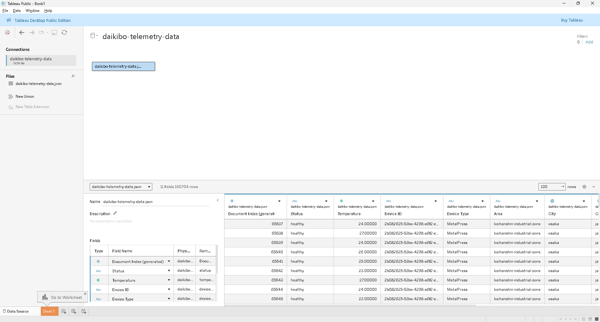
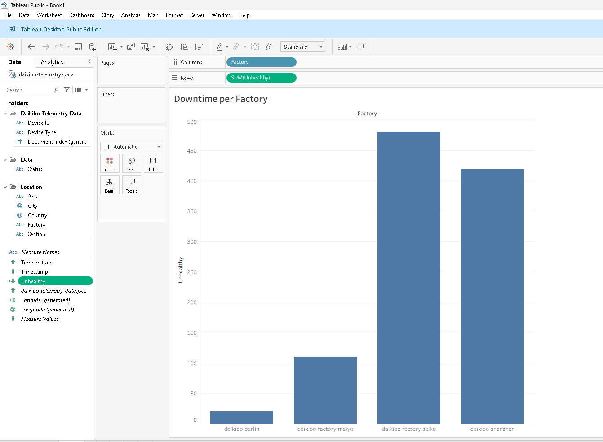
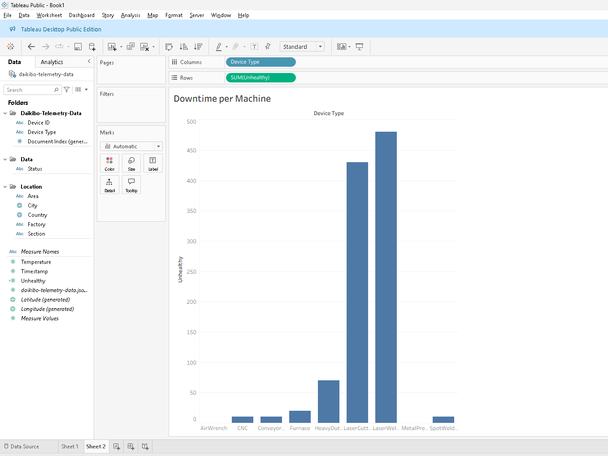
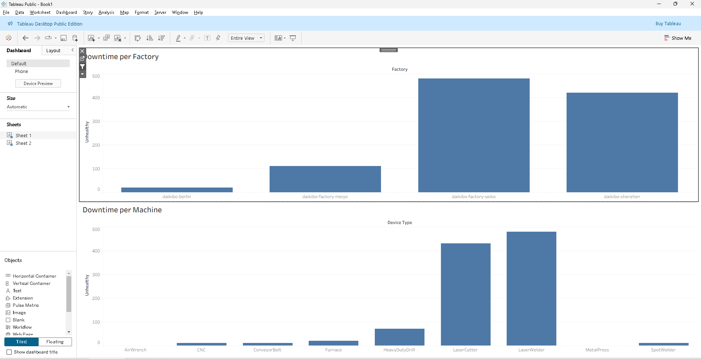
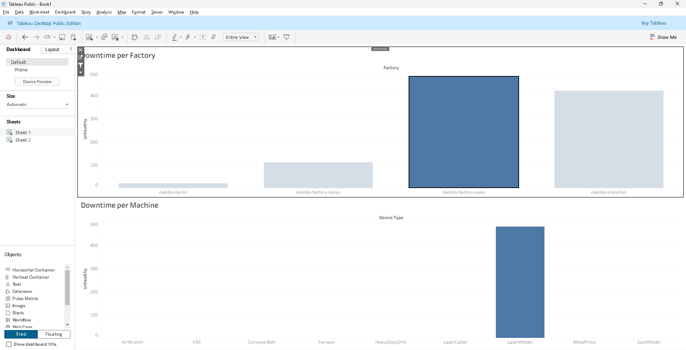

# Daikibo Industrials — Data Analysis Tasks

> **Client:** Daikibo Industrials | **Tools:** Tableau · Microsoft Excel | **Project:** Deloitte Virtual Experience

---

## 📊 Task 1 — Telemetry Data Analysis (Tableau)

Daikibo's tech team unified telemetry data from **4 factories** into a single JSON file covering **May 2021**. Each factory runs **9 machine types**, each sending a status message every **10 minutes**. The goal is to identify where and which machines broke down most.

### Factories
| Factory | Location |
|---|---|
| Daikibo Factory Meiyo | Tokyo, Japan |
| Daikibo Factory Seiko | Osaka, Japan |
| Daikibo Berlin | Berlin, Germany |
| Daikibo Shenzhen | Shenzhen, China |

---

### Step 1 — Import Data into Tableau

Download `daikibo-telemetry-data.json.zip`, unzip it, and import the JSON file into Tableau as a data source.



---

### Step 2 — Create "Unhealthy" Calculated Field

Create a new **calculated measure field** named `Unhealthy`. Assign a value of `10` for every row where the machine status is unhealthy (representing **10 minutes of potential downtime** since the last message).

```
IF [Status] = "unhealthy" THEN 10 ELSE 0 END
```


---

### Step 3 — "Down Time per Factory" Bar Chart

Using the `Unhealthy` measure, create a **bar chart** on a new sheet titled **"Down Time per Factory"**, with factory name on the X-axis and total unhealthy minutes on the Y-axis.



---

### Step 4 — "Down Time per Device Type" Bar Chart

On a **new sheet**, create a second bar chart titled **"Down Time per Device Type"**, showing total downtime broken down by machine/device type.



---

### Step 5 — Dashboard with Cross-Filter

Create a **Dashboard** combining both sheets. Configure the **"Down Time per Factory"** chart as a **filter action** — clicking a factory bar dynamically updates the **"Down Time per Device Type"** chart to show only that factory's machine breakdown.



---

### Step 6 — Select Factory with Most Downtime

Click the bar representing the **factory with the highest total downtime**. The second chart will update automatically. Take a screenshot of the resulting dashboard view.



---
### Insight
-Daikibo factory at Seiko have the highest downtime cause by Laser Welder device

-Daikibo factory at Shenzen have the second highest downtime cause by Laser Cutter device

-Daikibo factory at Meiyo have 1/5 downtime from top 2 factory cause by Heavy Duty Drill and Laser Cutter device

---

## 📋 Task 2 — Gender Pay Equality Analysis (Excel)

Following internal complaints about gender pay inequality, Daikibo Industrials commissioned a forensic algorithm to score gender pay equality across job roles and locations. Your task is to classify those scores.

---

### Process Log 1 — Load File into Excel

---

### Process Log 2 — Create "Equality Class" Column

Add a new column named **`Equality Class`** and apply the following classification formula based on the `Equality Score` field:

```excel
=IF([@[Equality Score]]=0,"Ideal",
  IF(OR([@[Equality Score]]<-20,[@[Equality Score]]>20),"Highly Discriminative",
    IF(OR([@[Equality Score]]<-10,[@[Equality Score]]>10),"Unfair",
      "Fair")))
```

| Equality Score Range | Classification |
|---|---|
| = 0 | ✅ Ideal |
| -10 to 10 (excl. 0) | 🟡 Fair |
| -20 to -10 or 10 to 20 | 🟠 Unfair |
| < -20 or > 20 | 🔴 Highly Discriminative |


